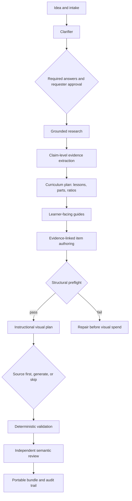

# Architecture and v0.2 milestone map

Knowledge Pack Studio is a headless, resumable engine presented through a native notebook. Colab,
Codespaces, and local Jupyter all call the same Python facade and deterministic workflow; none of
them requires a centrally hosted application service.

## Runtime shape

`StudioWorkflow` owns stage order and gates. `ArtifactStore` atomically checkpoints artifacts,
input hashes, stage states, agent calls, and readable events. `NotebookStudio` adds credential
injection, live event rendering, resume/status helpers, billable-action confirmations, and
diagnostics without becoming a second orchestration implementation.

The optional legacy browser module is lazy-loaded and is absent from the core dependency set.

## Logical agents

Each logical agent has a model, reasoning effort, and credential-profile name in the persisted
configuration. Credential values never enter that configuration. Current roles are clarifier,
researcher, extractor, curriculum designer, guide author, item author, visual director, and
semantic reviewer. Deterministic validation is code, not an LLM.

The research adapter uses OpenAI Responses web search and captures the returned source inventory.
Structured stages use strict Pydantic output contracts. The execution date is overwritten by the
orchestrator so an LLM cannot create stale `as_of_date` metadata.

## Content and cost gates

- Required clarification questions block approval until keyed answers exist.
- Curriculum planning precedes prose in the v0.2 notebook.
- Lessons contain 2–4 planned parts; each part targets 6–10 final items.
- Empty parts are deterministic errors; thin and oversized parts are reported explicitly.
- Structural/schema/evidence preflight runs before any image acquisition or generation.
- Generated-image calls and generation fallbacks require explicit confirmation.
- Mock output can exercise all stages but can never pass the publication gate.

## Visual acquisition

Visual planning uses a one-to-many `item_ids` contract so one teaching asset can correctly attach
to multiple items. Search terms and accessible alt text are bounded at the structured-output layer.

The source-first adapter invokes
[Image Source-cery](https://github.com/garygeo-19/image-sourcery) as a separate, pinned process. It
can rank Wikimedia, iNaturalist, Library of Congress, Openverse, NASA, The Met, Unsplash, Pexels,
Smithsonian, and optional generation. Returned assets retain source, rights, attribution, judge,
checksum, and target data. A failed candidate does not fabricate a placeholder.

## Data and trust boundaries

- Colab Secrets, Codespaces secrets, or local environment variables enter the active process only.
- Provider credentials are supplied by the author and never funded by a shared maintainer account.
- Requester files leave the runtime only when the author runs research.
- Model output and search results are untrusted until deterministic and semantic review.
- Sourced-image metadata still requires human rights verification.
- Generated images are instructional illustrations, never factual evidence.
- Export ZIPs separate the consumer pack from audit artifacts and include checksums.

## Implemented in v0.2

- native, serverless notebook with visible stage outputs;
- one-click Codespaces dev container using the same notebook;
- lightweight core installation with the old browser UI optional;
- complete-workspace resume and Drive checkpoints;
- persisted live progress, model/tool usage, activity export, and diagnostics;
- explicit brief and billable-image gates;
- Responses API web research and requester URLs/files;
- evidence ledger, curriculum plan, guide, item, visual, validation, and bundle artifacts;
- source-first image acquisition with provenance plus explicit generation;
- pinned portable pack JSON Schema and deterministic offline tests.

## Required before a community release candidate

- evaluate multiple live topics and publish cost/latency/quality fixtures;
- emit separate guide files per lesson and validate every heading/anchor deterministically;
- implement all canonical authored/derived shapes and upstream derivation tools;
- call the authoritative upstream Zod validator and consumer playability tests;
- add scoped repair/waiver workflows rather than whole-stage regeneration;
- deepen source authority, recency, independence, and contradiction scoring;
- add human review dispositions for items, lessons, sources, and asset rights;
- tag reviewed notebook releases and replace the mutable Studio install with a release pin.

The normative requirements under [`requirements/`](requirements/) take precedence over this
milestone summary.
