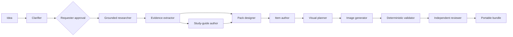

# Architecture and milestone map

Knowledge Pack Studio is a notebook-launched application, not a centrally hosted service. Colab
provides each author an ephemeral Python runtime; the author supplies the provider credential and
pays the provider directly. The repository supplies the UI, orchestration, schemas, prompts, and
validators.

## Runtime shape

`StudioWorkflow` is the deterministic orchestrator. Provider classes perform bounded model work;
they do not choose the next stage or approve their own output. `ArtifactStore` checkpoints every
artifact and records its input hashes so an upstream change can mark downstream work stale.

## Logical agents

Every logical agent has an independently editable model, reasoning effort, and credential-profile
name in the versioned run configuration. A single `default` credential is enough for ordinary use;
advanced users can map several profiles to different OpenAI projects or keys without persisting
secret values.

The current roles are clarifier, researcher, extractor, guide author, pack designer, item author,
visual director, and reviewer. The reviewer is a separate call from the authoring calls. The
deterministic validator remains code, not an LLM.

The OpenAI adapter follows the official API patterns for
[built-in web search](https://developers.openai.com/api/docs/guides/tools),
[Pydantic structured outputs](https://developers.openai.com/api/docs/guides/structured-outputs),
and [`gpt-image-2` generation](https://developers.openai.com/api/docs/guides/image-generation).
Research calls request the complete web-search source list and enforce the configured tool-call
budget at the API boundary.

## Data and trust boundaries

- Browser fields pass secrets to the active Python process only.
- Run configuration stores credential profile names, never credential values.
- Requester files are sent to the selected provider only when the author starts research.
- Web-search results and model output are untrusted inputs until extraction and validation.
- Generated images are teaching assets, never evidence.
- Mock output is watermarked in its artifacts and can never pass the publication gate.
- The export ZIP separates consumer files from audit evidence and includes checksums.

## Milestone 1 coverage

Implemented now:

- Colab/local launcher and five-tab Gradio interface;
- 12 visible, resumable stages with explicit brief approval;
- Responses API structured outputs and built-in web search;
- requester URL and file inputs;
- claim-level evidence ledger;
- study guide, curriculum design, item authoring, visual planning, and image generation;
- canonical JSON Schema validation plus referential, provenance, coverage, and ratio checks;
- independent semantic review;
- portable draft/publishable bundle with audit artifacts;
- deterministic offline mock and automated tests.

Planned before a community release candidate:

- evaluate live runs across representative, time-sensitive, and adversarial topics;
- enrich source metadata and classify primary/secondary evidence more reliably;
- add licensed image search/import alongside first-party image generation;
- implement the remaining canonical shapes and deterministic derived-item pipeline;
- run the upstream Zod validator and a consumer-runtime playability check in CI;
- add repair patches, waivers, budgets, and a human-review queue;
- add notebook release tags and pin Colab installs to a reviewed tag;
- publish evaluation fixtures and cost/latency reports.

The complete normative requirements and supporting authoring references are vendored under
[`requirements/`](requirements/). They take precedence over this milestone summary.
